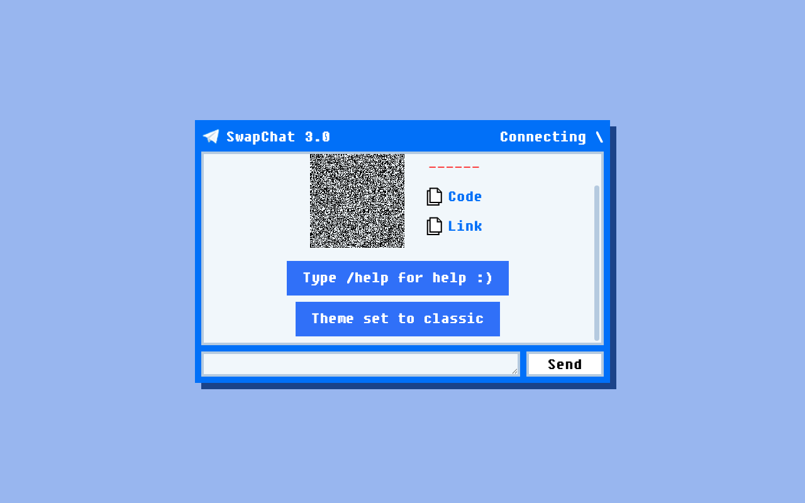
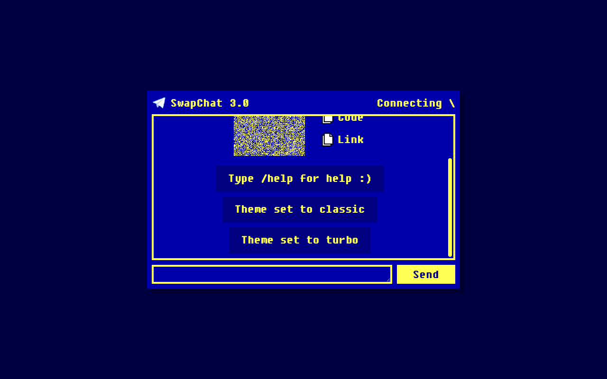
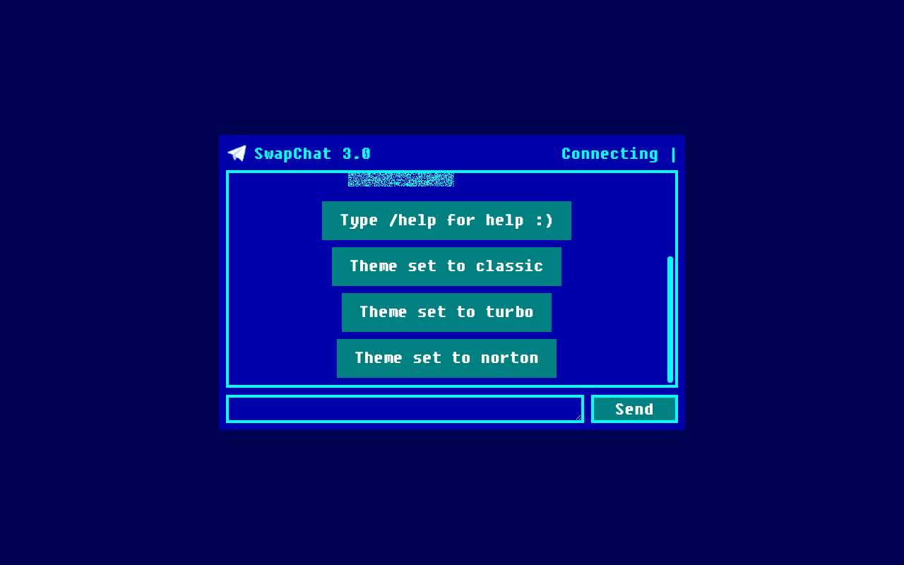
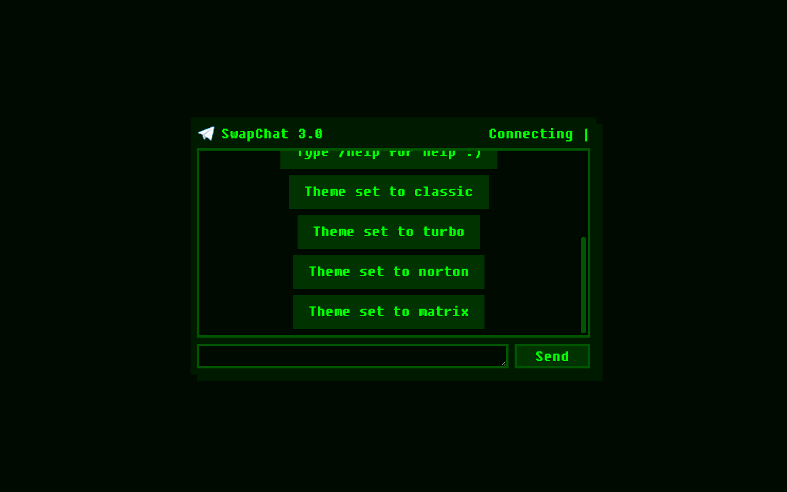
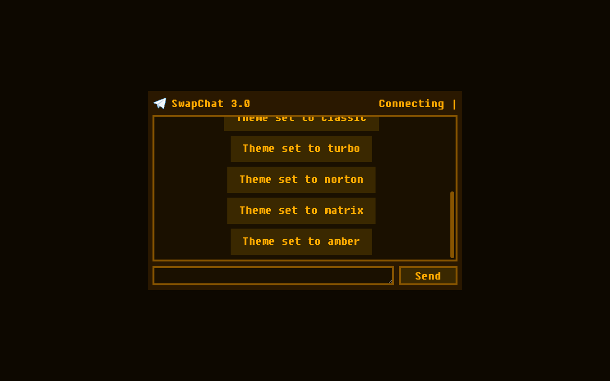
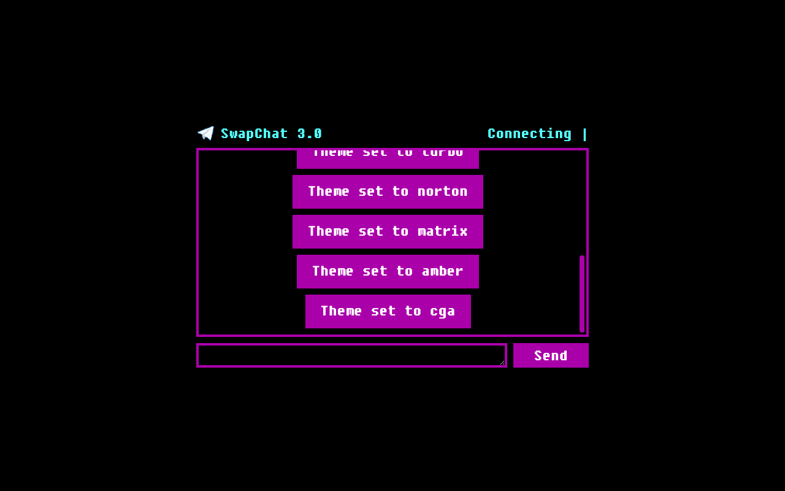
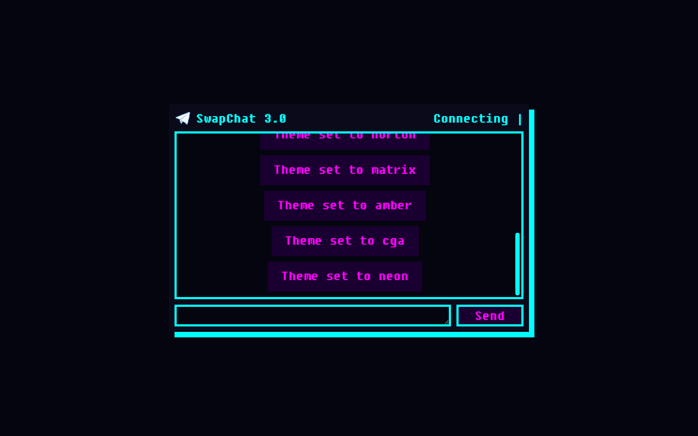

### SwapChat 3.0

End-to-end encrypted peer-to-peer chat on Ethereum Swarm. Post-quantum ready.

Built with [swapchat engine](https://github.com/significance/swapchat-engine) — a remake of the Swarm MAD 2019 [classic](https://github.com/felfele/swapchat) (credits @agazo, @nolash and myself).

> **TODO: STAMP CHUNK MANAGEMENT** — Currently using `Stamper.fromBlank()` which starts at bucket index 0 every time. Stamp state is persisted in localStorage but this is fragile. Need proper stamp bucket state management: either query the Bee node for current utilisation, or persist state more robustly. Without this, stamp index collisions will cause upload failures after localStorage is cleared.

#### Quick Start

```
npm install
npm run dev
```

Works with the public Swarm gateway (`api.gateway.ethswarm.org`) or a local Bee node.

#### Setup

Copy `.env.example` to `.env` and configure:

- `VITE_BEE_API` — Bee node or gateway URL (default: `https://api.gateway.ethswarm.org`)
- `VITE_BEE_GATEWAY_MODE` — Use zero stamp for public gateways (`true`/`false`)
- `VITE_BEE_SIGNER_KEY` — Private key for client-side stamp signing (optional, prompted in UI)
- `VITE_BEE_STAMP` — Postage batch ID (optional, prompted in UI)
- `VITE_BEE_STAMP_DEPTH` — Stamp depth (default: 20)
- `VITE_REQUIRE_TERMS` — Show terms BSOD on startup (`true`/`false`)

Or enter signer key and batch ID through the DOS-style setup screens on first run.

#### Stamp Management

```
just balances       # check signer wallet
just buy-stamp      # buy a new postage stamp
just check-stamp    # check stamp on-chain
```

Requires [just](https://github.com/casey/just) and [foundry](https://getfoundry.sh/) (`cast`).

#### Slash Commands

| Command | Description |
|---------|-------------|
| `/help` | Show help menu |
| `/help connect` | Connection instructions |
| `/theme` | List available themes |
| `/theme <name>` | Switch theme (classic, turbo, norton, matrix, amber, cga, neon, tron) |
| `/qr` | Fullscreen QR code |
| `/gateway` | Check current gateway |
| `/gateway <url>` | Switch gateway |
| `/fs` | Fullscreen mode |
| `/code` | Copy token to clipboard |
| `/link` | Copy chat link |
| `/d` | Open as respondent in new tab |
| `/cursor` | Toggle DOS cursor |
| `/links` | Useful links |
| `/clear` | Clear messages |
| `/reset` | Clear all settings and reload |

#### Themes

| | |
|---|---|
|  **classic** |  **turbo** |
|  **norton** |  **matrix** |
|  **amber** |  **cga** |
|  **neon** | *+ 1 secret theme* |

#### Testing

```
cp .env.test.example .env.test   # configure test credentials
npm run test:e2e                  # headless
npm run test:e2e:headed           # watch in browser
```

#### Stack

- Vite 6, React 18, TypeScript 5, Node 22
- Hybrid PQ encryption: ECDH + ML-KEM-768 via HKDF-SHA256
- SOC endpoint uploads (`/soc/{owner}/{id}`), all signing client-side
- Client-side postage stamp construction
- 8 DOS colour themes
- Playwright e2e tests

Beeta software, use at your own risk! <3
